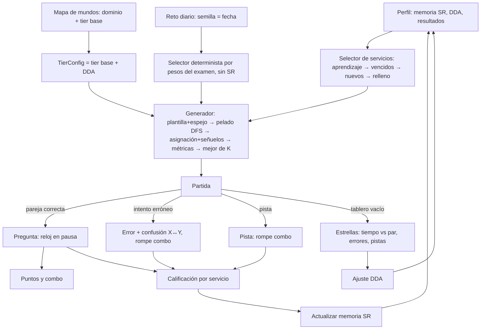

# DISENO-ALGORITMO.md: Mahjong de estudio AWS Cloud Practitioner (CLF-C02)

- **Versión del documento:** 1.0 (2026-10-09)
- **Destinatario:** Codex (implementación). Este documento define algoritmos, estructuras de datos y pruebas. No define arte ni UI detallada.
- **Plataforma:** web, Phaser 4, móvil en vertical, PWA.

---

## 0. Resumen (leer primero)

1. **Arquitectura.** Toda la lógica vive en un núcleo TypeScript puro (`src/core/**`) que no importa Phaser y se prueba en Node con Vitest. Phaser solo dibuja, anima y reenvía toques al núcleo.
2. **Geometría.** Coordenadas en medias unidades (idea tomada de ffalt/mah). Una ficha está libre si nada de una capa superior la solapa y tiene libre el lado izquierdo o el derecho.
3. **Generación.** El método "al revés" del borrador es correcto **solo si las dos posiciones de cada pareja salen de la misma lista de libres, calculada antes de retirar ninguna**. El "si no hay dos libres, reiniciar" se sustituye por una búsqueda en profundidad con retroceso (backtracking) y memoria de estados muertos. Esa búsqueda siempre encuentra solución cuando existe y detecta los layouts imposibles.
4. **Hallazgo clave.** Cada servicio aparece una sola vez por tablero (1 ficha ícono + 1 ficha nombre). Por eso **un tablero resoluble no puede bloquearse nunca, juegue como juegue el jugador** (demostración en §6, confirmada con unas 130 000 partidas simuladas). La mezcla por bloqueo y el deshacer dejan de ser necesarios en la campaña. Se implementan igualmente como red de seguridad y para un modo opcional de "fichas dobles".
5. **Dificultad.** Como no hay callejones sin salida, la dificultad sale de otras cosas: cuántas parejas hay disponibles a la vez, la distancia entre las dos fichas de una pareja, las parejas cuya compañera está tapada, las capas y los servicios que se confunden entre sí. Se mide por simulación y, de K candidatos, se elige el más cercano al objetivo del nivel.
6. **Repetición espaciada.** Sistema Leitner de 6 cajas más pasos de reaprendizaje medidos en niveles (al estilo de Anki). Un servicio fallado vuelve en el siguiente nivel de su dominio y en los niveles de repaso.
7. **Reto diario.** Semilla derivada de la fecha y PRNG `mulberry32`, más selección por *rendezvous hashing* (ideas de mah). **No** usa datos personales, así que el tablero es igual para todos.

---

## 1. Supuestos y decisiones por defecto

Todos se pueden cambiar con configuración. Si alguno no te convence, cámbialo aquí antes de que Codex empiece.

| # | Supuesto | Config |
|---|---|---|
| S1 | Cada servicio aparece **como máximo una vez por tablero**: una ficha ícono y una ficha nombre. | `allowDuplicates = false` |
| S2 | Un ícono solo empareja con el nombre del mismo servicio. Tocar ícono+ícono o nombre+nombre no cuenta como intento: solo cambia la selección. | — |
| S3 | Si la respuesta a la pregunta es incorrecta, la pareja se retira igual, se muestra la respuesta correcta con su explicación, se cuenta un error, se rompe el combo y el servicio se penaliza en la repetición espaciada. | `wrongAnswerPolicy = 'remove' \| 'return'` |
| S4 | El **reloj del tablero se pausa** mientras la pregunta está abierta, durante las animaciones y con la app en segundo plano. No se castiga leer. | — |
| S5 | Los layouts son plantillas diseñadas a mano en JSON, validadas offline. De cada una salen 4 variantes por espejo. | — |
| S6 | No hay backend. El progreso se guarda en el dispositivo (IndexedDB, o localStorage como respaldo). | — |
| S7 | La fecha del reto diario es la **fecha local** del dispositivo, como en mah. | `dailyClock = 'local' \| 'utc'` |
| S8 | Dominios CLF-C02 y pesos del examen: D1 Conceptos de la nube 24 %, D2 Seguridad y cumplimiento 30 %, D3 Tecnología y servicios en la nube 34 %, D4 Facturación, precios y soporte 12 %. | `DOMAIN_WEIGHTS` |
| S9 | Se pregunta en **todas** las parejas, como pide el diseño. Existe como opción una política adaptativa (§9.5). | `questionPolicy = 'always' \| 'adaptive'` |
| S10 | En D1 hay conceptos sin ícono oficial de servicio (pilares del Well-Architected Framework, perspectivas del CAF, estrategias de migración…). Se modelan igual: un pictograma propio como "ícono" y el nombre del concepto. | `Service.kind = 'service' \| 'concept'` |

---

## 2. Referencias: qué se toma de ffalt/mah y de dónde sale cada idea

Revisé el código de `ffalt/mah` (rama `main`, octubre de 2026), sobre todo `src/app/model/`. Esta tabla dice de dónde viene cada idea y qué cambia en nuestro diseño.

| # | Idea | Dónde está en mah | Qué hacemos nosotros |
|---|---|---|---|
| R1 | Coordenadas en **medias unidades**: cada ficha ocupa 2×2 celdas, lo que permite medias posiciones. | `builder/base.ts` (`collectNodes`), `mapping.ts` | Igual. |
| R2 | Vecinos: izquierda en `x−2` y derecha en `x+2`, ambos con `\|dy\| ≤ 1`; "encima" en `z+1` con `\|dx\| ≤ 1` y `\|dy\| ≤ 1`. | `builder/base.ts` → `collectNodes` | Igual, salvo que "encima" es **cualquier capa superior** que solape, no solo `z+1`. Así no hay sorpresas con fichas en voladizo (§3.4). |
| R3 | Bloqueada = tiene algo encima, o tiene fichas a izquierda **y** a derecha. | `stone.ts` → `isBlocked()` | Igual: es la regla del juego. |
| R4 | Detección de solapes en layouts. | `mapping.ts` → `findPlaceCollisions` | Igual, dentro del validador de plantillas (§4.3). |
| R5 | Generación resoluble: las libres se calculan una vez por pareja y se extraen dos al azar. Si quedan menos de 2 libres, se reinicia (hasta 2000 veces), luego se prueba una estrategia alternativa y, como último recurso, se genera **un tablero aleatorio que puede no tener solución**. | `builder/solvable.ts` (`assignTilePairs`, `MAX_RUNS = 2000`), `builder/random.ts` | Mismo principio. Los reinicios ciegos se cambian por DFS con backtracking y memoria (§5.2). **Nunca** se devuelve un tablero sin solución. |
| R6 | Restricción de "anchura" (mínimo y máximo de fichas libres durante la generación) como palanca de dificultad. | `builder/solvable.ts` → `breadthConstraint` | Se generaliza a métricas por simulación y a "generar K, elegir el mejor" (§7). |
| R7 | Mezcla: reconstruir las fichas restantes con el mismo generador sobre las posiciones que quedan, con hasta 20 intentos de rescate. | `board.ts` → `shuffle()`; `game.ts` → `gameOverEasyModeShuffle`; `consts.ts` → `RESCUE_SHUFFLE_ATTEMPTS = 20` | Misma idea, con garantía añadida: si la geometría restante no admite ningún orden, se reubican fichas en la capa 0 (§8.3). |
| R8 | Pista: agrupar las fichas libres por grupo, ciclar entre parejas en pulsaciones sucesivas y dar prioridad a la del seleccionado. | `board.ts` → `hint()`, `collectHints`, `hintNext` | Igual, con una prioridad extra para el aprendizaje (§8.1). |
| R9 | Deshacer: pila de posiciones; cada deshacer saca dos. | `board.ts` → `undo`, `back()` | Pila de jugadas con más datos (puntos, combo) (§8.2). |
| R10 | Combos: ventana de 5000 ms, multiplicadores `[1, 1.25, 1.5, 2, 3]`, base de 100 puntos + 15 por capa. Deshacer restaura los puntos y rompe el combo. | `challenge/score.ts` | Misma base, pero la ventana se mide en **tiempo de tablero**, que se pausa con la pregunta (§11.2). |
| R11 | PRNG con semilla: `mulberry32` + `stringToSeed` (hash de 32 bits y mezcla). | `rng.ts`, `hash.ts` | Igual, pero la instancia del PRNG **se pasa explícitamente**. mah sustituye un RNG global con `seedRNG/resetRNG`, que es frágil (§11.4). |
| R12 | Reto diario: clave `YYYY-MM-DD` en hora local, semilla `daily-<clave>` y elección *highest random weight* (rendezvous), con la que añadir o quitar una opción solo cambia los días que esa opción ganaba. | `challenge/daily.ts` (`dailyKey`, `dailySeed`, `pickDailyItem`) | Igual (§11.4). |
| R13 | Guardar posiciones, valores y pila de deshacer, y **no regenerar al recargar**. | `board.ts` → `save()` / `load()` | Igual. |
| R14 | Solver completo para grupos de 4 fichas, portado de *mjsolver* de Michiel de Bondt. | `src/app/model/solver/` | **No hace falta.** Con parejas únicas basta un simulador voraz (§5.4 y §6). Solo sería útil si algún día hubiera grupos de 4. |

**Lo que mah no resuelve y diseñamos desde cero:** parejas ícono-nombre, pregunta de función con distractores, repetición espaciada, curva de dificultad ligada al contenido, estrellas por nivel, y la demostración de que no hay bloqueos con parejas únicas.

### 2.1 Licencias y avisos

- **mah:** licencia MIT, `Copyright (c) 2016 ffalt`.
- **Solver de mah:** licencia MIT, `Copyright (c) 2007 Michiel de Bondt`, "ported to typescript and adapted by ffalt".

**Recomendación: reimplementar, no copiar.** El código de mah depende de Angular (signals) y nuestras estructuras son distintas (bitmasks, caras ícono/nombre). Inspirarse en las ideas no obliga a nada. Copiar o adaptar texto de código sí obliga a conservar el aviso. Si Codex copia o adapta literalmente algún fragmento (por ejemplo `collectNodes`, `mulberry32`/`stringToSeed` o `pickDailyItem`):

1. Crear `THIRD_PARTY_NOTICES.md` en la raíz con el texto completo de la licencia MIT de mah y la línea `Copyright (c) 2016 ffalt`.
2. Poner una cabecera en cada archivo afectado: `// Adaptado de ffalt/mah (MIT, Copyright (c) 2016 ffalt): src/app/model/rng.ts`.
3. Si se portara el solver, añadir además el aviso MIT de Michiel de Bondt (2007).

`mulberry32` es un algoritmo público muy difundido. Aun así, si se copia la versión de mah, se mantiene el aviso. Como cortesía, aunque no sea obligatorio, conviene acreditar a mah en la pantalla de créditos.

---

## 3. Geometría: coordenadas, vecinos y ficha libre

### 3.1 Coordenadas

```ts
type Slot = readonly [x: number, y: number, z: number]; // enteros, en MEDIAS unidades
// La ficha ocupa [x, x+2) × [y, y+2) en la capa z. Una coordenada impar = media posición.
```

### 3.2 Precálculo de vecinos

Se calcula una vez por layout, en O(n²) con n ≤ 24. Se usan **bitmasks** con n ≤ 30 (los operadores de bits de JS trabajan con int32).

```ts
interface Geometry {
  n: number;
  slots: Slot[];
  above: number[];   // bitmask de fichas que solapan desde CUALQUIER capa superior
  below: number[];   // inversa de above
  left: number[];    // misma capa, x-2, |dy| <= 1
  right: number[];   // misma capa, x+2, |dy| <= 1
  full: number;      // (1 << n) - 1
}

function buildGeometry(slots: Slot[]): Geometry {
  // por cada par i != j:
  //   si zj == zi y |yj-yi| <= 1:  xj == xi-2 → left[i] |= bit(j);  xj == xi+2 → right[i] |= bit(j)
  //   si zj >  zi y |xj-xi| <= 1 y |yj-yi| <= 1 → above[i] |= bit(j); below[j] |= bit(i)
}
```

### 3.3 Ficha libre

```ts
const bit = (i: number) => 1 << i;

function isFree(g: Geometry, present: number, i: number): boolean {
  return (present & bit(i)) !== 0
      && (present & g.above[i]) === 0
      && ((present & g.left[i]) === 0 || (present & g.right[i]) === 0);
}

function freeList(g: Geometry, present: number): number[] { /* índices i con isFree */ }
```

**Propiedad imprescindible (monotonía):** si una ficha está libre con el conjunto `S` de fichas presentes, sigue libre con cualquier subconjunto de `S` que la contenga. Quitar fichas nunca bloquea a otra. Las garantías de §5 y §6 dependen de esto. **Cualquier regla nueva** (fichas congeladas, candados, etc.) tiene que conservar la monotonía, o deja de valer la garantía.

### 3.4 Casos límite de medias posiciones y capas

| Caso | Ejemplo (x,y,z) | Resultado |
|---|---|---|
| Vecino lateral desplazado media fila | `[0,0,0]`, `[2,1,0]` | Lo bloquea por ese lado (`\|dy\| = 1`). |
| Hueco de media ficha | `[0,0,0]`, `[3,0,0]` | **No** son vecinos (`dx = 3`); ese lado está libre. |
| Ficha superior desplazada media ficha | `[0,0,0]`, `[1,0,1]` | La de abajo queda tapada. |
| "Puente" sobre 2 o 4 fichas | `[1,1,1]` sobre `[0,0,0] [2,0,0] [0,2,0] [2,2,0]` | Las 4 de abajo quedan tapadas. |
| Ficha en la capa superior a `dx = ±2` | `[0,0,0]`, `[2,0,1]` | No tapa (no solapa) y tampoco es vecina lateral (otra capa). |
| Voladizo: capa `z+2` sin nada en `z+1` | `[0,0,0]`, `[1,0,2]` | Con nuestra regla, **tapa**. En mah no taparía, porque solo mira `z+1`. El validador lo avisa. |
| Ficha flotante (`z > 0` sin nada debajo) | `[0,0,1]` sola | El validador la **rechaza** (visualmente confunde). |
| Solape en la misma capa | `\|dx\| < 2` y `\|dy\| < 2` | Error de layout. |
| Número impar de posiciones | — | Error de layout. mah descarta la última; nosotros lo prohibimos porque las plantillas son nuestras. |
| Coordenadas negativas | — | Se normalizan al cargar: se resta el mínimo de x, de y y de z. |

**Render y toques (Phaser).** Se pinta en orden z ascendente, luego y, luego x (`depth = z*10000 + y*100 + x`), con un desplazamiento 3D por capa. Al tocar, se elige la ficha **más alta** cuyo rectángulo contiene el punto.

---

## 4. Plantillas de layout

### 4.1 Formato

```json
{
  "id": "t3-escalera-16",
  "version": 1,
  "tiers": [3, 4],
  "slots": [[0,0,0],[2,0,0],[4,0,0],[6,0,0],[1,1,1],[5,1,1]],
  "tags": ["medias-posiciones", "2-capas"]
}
```

### 4.2 Restricciones de móvil en vertical

- Ancho máximo de **5 fichas** (extensión en x ≤ 10 medias unidades). Con 360 px CSS de ancho deja fichas de unos 60 px. Alto máximo de **8 filas**.
- Hasta 3 capas (4 solo en niveles "jefe").
- Las fichas de nombre usan `shortName` (≤ 14 caracteres, hasta 2 líneas).

### 4.3 Validación offline (test que recorre todas las plantillas)

1. Número par de fichas, entre 12 y 24.
2. Sin solapes y sin fichas flotantes. Los voladizos dan aviso.
3. Dentro de los límites de §4.2.
4. **Resolubilidad geométrica exhaustiva** (`geomSolvableExhaustive`, §5.4): existe al menos un orden de retirada por parejas.
5. La dificultad media (muestreada en §7) cae dentro del rango de los tiers declarados.

### 4.4 Variantes gratis

El espejo horizontal (`x' = maxX − x`) y el vertical (`y' = maxY − y`) **conservan la resolubilidad**: las reglas son simétricas entre izquierda y derecha y no dependen del signo de `dy`. Cada plantilla da 4 variantes. Con 6 a 8 plantillas por tier (unas 40 en total) salen unas 160 formas distintas, antes incluso de reasignar los servicios.

---

## 5. Generación con solución garantizada

### 5.1 Validación del método al revés del borrador

**Por qué funciona.** Se parte del tablero lleno y se eligen dos posiciones `a` y `b` que estén libres **a la vez** en el estado actual `S`. Cuando el jugador llegue a ese mismo estado `S`, podrá retirar `(a, b)`. Por inducción, la secuencia de extracciones (el "testigo") es una partida válida. La asignación de caras (ícono o nombre) no afecta a la libertad de las fichas.

**Condiciones obligatorias:**

1. **Calcular las libres una sola vez y elegir las dos de esa misma lista.** El error clásico es retirar la primera y recalcular las libres antes de elegir la segunda. Eso permite emparejar una ficha con la que la estaba tapando o encerrando, y el tablero resultante no tiene solución.
2. "Libre" se calcula siempre sobre las posiciones **aún no extraídas**.
3. No repetir un servicio en el mismo tablero (S1). Si se repite, la garantía cambia (§6, §8.4).

**Casos límite:**

- **Medias posiciones:** no afectan a la validez del método. Solo cambian qué fichas están libres. El método solo depende de la monotonía (§3.3).
- **Capas:** las pilas altas son las que provocan fallos. Si al final solo quedan fichas de una misma torre, solo la de arriba está libre y el método se atasca. Dos ejemplos mínimos:
  - *Torre de 3 + 1 ficha suelta*: imposible con cualquier asignación. El generador tiene que **detectarlo**, no reintentar sin fin.
  - *Torre de 2 + 2 sueltas*: si primero se extraen las dos sueltas, atasco. Si se extrae la de arriba junto con una suelta, sale bien. Aquí el orden importa.
- **Reinicios frecuentes:** con 24 fichas no son un problema de rendimiento, pero sí de **garantía**. Un reinicio ciego nunca puede demostrar que un layout es imposible, y mah, tras agotar los reintentos, devuelve un tablero aleatorio sin garantía.

### 5.2 Algoritmo propuesto: "pelado" con DFS, memoria y heurística

```ts
type Pair = [number, number];
type PeelResult = { order: Pair[] } | { error: 'UNSOLVABLE' | 'BUDGET' };

function peel(g: Geometry, cfg: TierConfig, rng: Rng, budget = 50_000): PeelResult {
  const dead = new Set<number>();          // estados sin solución (no dependen del camino)
  let nodes = 0;

  function rec(present: number): Pair[] | null {
    if (present === 0) return [];
    if (dead.has(present) || ++nodes > budget) return null;
    const free = freeList(g, present);     // UNA sola vez por estado (condición 1 de §5.1)
    if (free.length < 2) { dead.add(present); return null; }

    const pairs: Pair[] = [], weights: number[] = [];
    for (let i = 0; i < free.length; i++)
      for (let j = i + 1; j < free.length; j++) {
        const a = free[i], b = free[j];
        pairs.push([a, b]);
        weights.push(tileWeight(g, present, a) * tileWeight(g, present, b) * distWeight(g, a, b, cfg));
      }

    // sorteo perezoso sin reemplazo: casi siempre basta la primera pareja
    while (pairs.length) {
      const k = weightedIndex(weights, rng);
      const [a, b] = pairs[k];
      pairs.splice(k, 1); weights.splice(k, 1);
      const rest = rec(present & ~(bit(a) | bit(b)));
      if (rest) return [[a, b], ...rest];
      if (nodes > budget) return null;
    }
    dead.add(present);
    return null;
  }

  const order = rec(g.full);
  if (order) return { order };
  return { error: nodes > budget ? 'BUDGET' : 'UNSOLVABLE' };
}

// Heurística entera: vaciar antes las cimas de las pilas (evita torres huérfanas)
function tileWeight(g: Geometry, present: number, t: number): number {
  return 1 + 2 * popcount(present & g.below[t]) + g.slots[t][2];
}

// Distancia entre las dos fichas de la pareja, en fichas (Chebyshev; ignora z)
function pairDistance(g: Geometry, a: number, b: number): number {
  const [xa, ya] = g.slots[a], [xb, yb] = g.slots[b];
  return Math.max(Math.abs(xa - xb), Math.abs(ya - yb)) / 2;
}
function distBucket(d: number): 0 | 1 | 2 | 3 { return d <= 1 ? 0 : d <= 2 ? 1 : d <= 3 ? 2 : 3; } // 0 = "pegadas"
function distWeight(g: Geometry, a: number, b: number, cfg: TierConfig): number {
  return cfg.distWeights[distBucket(pairDistance(g, a, b))];          // enteros, tabla en §7.4
}

// Índice ponderado con enteros (determinista en todos los motores JS)
function weightedIndex(w: number[], rng: Rng): number {
  let total = 0; for (const x of w) total += x;
  let r = rng.int(total), k = 0;
  while (r >= w[k]) { r -= w[k]; k++; }
  return k;
}
```

- **Completitud:** como la búsqueda prueba todas las parejas de cada estado y recuerda los estados muertos, si existe un orden lo encuentra. Si devuelve `UNSOLVABLE`, el layout es imposible.
- **Presupuesto:** si devuelve `BUDGET`, se reintenta con otra subsemilla (`rng.fork('peel#2')`, hasta 5 veces). Si sigue fallando, se lanza `LayoutError`. Con plantillas validadas no debería ocurrir nunca.
- **Los pesos solo cambian el orden de exploración**, nunca la garantía. Así, la distancia entre las fichas de cada pareja queda controlada sin riesgo (§7).

### 5.3 Asignación de servicios y caras

```ts
function assign(order: Pair[], services: ServiceId[], rng: Rng): TileSpec[] {
  const svc = shuffle(services, rng);             // en tiers altos: optimización de señuelos (§7.5)
  const tiles: TileSpec[] = [];
  order.forEach(([a, b], k) => {
    const iconOnA = rng.int(2) === 0;
    tiles[a] = { slot: a, serviceId: svc[k], face: iconOnA ? 'icon' : 'name' };
    tiles[b] = { slot: b, serviceId: svc[k], face: iconOnA ? 'name' : 'icon' };
  });
  return tiles;
}
```

Restricción de equilibrio: entre las fichas libres al inicio, los íconos deben ser entre el 35 % y el 65 %. Si no se cumple, se vuelven a sortear las caras (hasta 10 veces; es barato y no toca la geometría).

### 5.4 Verificación (también en producción; cuesta menos de 1 ms)

```ts
// Parejas disponibles: fichas libres del mismo servicio con caras distintas
function availablePairs(g: Geometry, tiles: TileSpec[], present: number): Pair[] {
  // agrupar freeList por serviceId → para cada servicio, cada combinación (icono libre × nombre libre)
}

// Parejas únicas: basta el simulador voraz (correcto por el teorema de §6)
function solveGreedy(g: Geometry, tiles: TileSpec[], present = g.full): boolean {
  while (present) {
    const p = availablePairs(g, tiles, present)[0];
    if (!p) return false;
    present &= ~(bit(p[0]) | bit(p[1]));
  }
  return true;
}

// Plantillas (offline/tests): ¿existe ALGÚN orden de retirada por parejas?
function geomSolvableExhaustive(g: Geometry): boolean { /* DFS sobre todos los pares libres + memo de muertos */ }

// Modo "fichas dobles": búsqueda exhaustiva sobre availablePairs + memo
function assignmentSolvableExhaustive(g: Geometry, tiles: TileSpec[], present: number): boolean { /* … */ }
```

`generateBoard` termina siempre con `assert(solveGreedy(...))`. Si falla, es un bug y se regenera con otra subsemilla.

### 5.5 Resultados del prototipo de validación

Escribí un prototipo desechable en Node (no se entrega) con estas mismas reglas, para medir el método antes de dártelo. Cada layout se probó 2000 veces:

| Layout de prueba | Fichas / capas | Método ciego estilo mah: % que reinicia (máx.) | Error clásico: % de tableros **sin solución** | DFS propuesto: nodos máx. | Parejas únicas: partidas aleatorias bloqueadas | Parejas dobles: bloqueadas |
|---|---|---|---|---|---|---|
| Plano 3×4 | 12 / 1 | 0 % (0) | 0 % | 6 | 0 / 2000 | 0 % |
| 4×3 + 4 a media posición | 16 / 2 | 0 % (0) | **57,7 %** | 8 | 0 / 2000 | 11,8 % |
| Tres capas | 20 / 3 | 2,3 % (2) | **53,8 %** | 10 | 0 / 2000 | 20,1 % |
| Pirámide | 24 / 3 | 1,9 % (3) | **64,9 %** | 12 | 0 / 2000 | 17,6 % |
| Muchas torres de 2–3 | 24 / 3 | 28,9 % (7) | **73,9 %** | 14 | 0 / 2000 | 24,8 % |
| Torre de 3 + 1 suelta | 4 / 3 | — | — | detecta `UNSOLVABLE` | — | — |

Fuzzing con 6000 layouts aleatorios (3000 normales de hasta 4 capas y 3000 densos con torres de hasta 6 capas):

- El DFS coincide con la búsqueda exhaustiva en **6000 de 6000** casos y detectó los 6 layouts imposibles.
- El método ciego falló una vez tras 2000 reinicios **en un layout que sí tenía solución**.
- El DFS necesitó como máximo 52 nodos y menos de 2 ms.
- Con parejas únicas, **0 bloqueos** en unas 120 000 partidas aleatorias.
- En modo dobles, los 1486 bloqueos se resolvieron con la mezcla de §8.3 (el 100 % quedó resoluble). 392 de ellos necesitaron reubicar fichas.

---

## 6. Teorema: con parejas únicas no hay bloqueos

**Enunciado.** Si (a) la regla de ficha libre es monótona (§3.3), (b) cada servicio tiene exactamente dos fichas en el tablero (ícono y nombre) y (c) el tablero inicial es resoluble, entonces **cualquier** secuencia de jugadas válidas termina vaciando el tablero.

**Demostración.** Sea `S` resoluble con la secuencia `P1…Pk`, y supongamos que el jugador retira una pareja disponible cualquiera `Q`. Como cada servicio tiene solo dos fichas, `Q` es alguna `Pj`. La secuencia `P1…Pj−1, Pj+1…Pk` funciona desde `S∖Q`:

- Para `i < j`, el estado antes de `Pi` es el original menos `Q`, es decir, un subconjunto. Por monotonía, las dos fichas de `Pi` siguen libres.
- Para `i > j`, el estado es idéntico al original.

Por tanto `S∖Q` es resoluble. Además, todo estado resoluble no vacío tiene al menos una pareja disponible (`P1`). Por inducción, ninguna partida puede atascarse. ∎

Con fichas dobles (dos íconos y dos nombres de un mismo servicio), `Q` puede cruzar el ícono de `Pj` con el nombre de `Pm` y la demostración ya no vale. El prototipo lo confirma: entre un 12 % y un 25 % de partidas bloqueadas.

**Consecuencias de diseño:**

1. "Sin tableros frustrantes" queda garantizado por construcción.
2. **La mezcla por bloqueo nunca se dispara en la campaña.** Se implementa como red de seguridad (guardado corrupto, bug, modo dobles futuro) y hay un test que comprueba que no se activa (§14).
3. **Deshacer no tiene valor estratégico**, porque no existen jugadas malas. Recomendación: **ocultar el botón** en la campaña y en el reto diario, y mantener la pila para guardar y restaurar, depurar y para el modo dobles. Si se decide mostrarlo, ver las reglas antiabuso de §8.2.
4. **Pista:** cualquier pareja disponible es segura.
5. `wrongAnswerPolicy = 'return'` también es segura: devolver la pareja lleva a un estado anterior, que era resoluble.
6. La dificultad hay que construirla de otra forma (§7). Si se quiere la tensión estratégica del Mahjong clásico, existe el modo opcional "fichas dobles" (§8.4).

---

## 7. Control de dificultad

### 7.1 De dónde sale la dificultad

| Factor | Símbolo | Efecto |
|---|---|---|
| Parejas disponibles a la vez | `A0` (al inicio), `Ā` (media), `A10` (percentil 10) | Menos parejas disponibles = más búsqueda. |
| Compañera tapada | `H` = fracción de fichas libres al inicio cuya pareja está bloqueada | "Veo el ícono pero no encuentro el nombre". |
| Distancia entre las fichas de la pareja | `D̄` (media en fichas), `adj` (fracción de parejas "pegadas", d ≤ 1) | Lo que pedías: que las parejas no queden siempre juntas. |
| Capas y medias posiciones | `layers` | Más carga visual. |
| Tamaño | `n` | 12 a 24 fichas. |
| Confusión cognitiva | `C` | Servicios de la misma categoría, o que el jugador ya confundió, en el mismo tablero (§7.5). |

### 7.2 Métricas por simulación

```ts
function measure(g: Geometry, tiles: TileSpec[], rng: Rng, playouts = 24): BoardMetrics {
  const samples: number[] = [];
  for (let p = 0; p < playouts; p++) {
    let present = g.full;
    while (present) {
      const av = availablePairs(g, tiles, present);
      samples.push(av.length);
      const [a, b] = av[rng.int(av.length)];
      present &= ~(bit(a) | bit(b));
    }
  }
  // A0, Ā = media(samples), A10 = percentil10(samples), H, D̄, adj, layers, n
  // D (abajo) y parTimeMs (§11.3)
}
```

**Puntuación de dificultad geométrica** en [0, 1]. Todos los pesos son configurables y se calibran en pruebas con jugadores:

```
a = clamp((6 − Ā) / 5, 0, 1)        // Ā = 1 → 1 ;  Ā ≥ 6 → 0
h = H
d = clamp((D̄ − 1) / 3, 0, 1)        // 1 ficha → 0 ;  ≥ 4 → 1
j = 1 − adj
l = clamp((layers − 1) / 2, 0, 1)
s = (n − 12) / 12
D = 0.30·a + 0.20·h + 0.15·d + 0.10·j + 0.10·l + 0.15·s
```

### 7.3 Generar K candidatos y elegir el mejor

```ts
function generateBoard(template: LayoutTemplate, services: ServiceId[], cfg: TierConfig, rng: Rng): BoardSetup {
  let best: Candidate | null = null, bestSoft: Candidate | null = null;
  for (let k = 0; k < cfg.candidates /* 12 */; k++) {
    const r = rng.fork(`cand#${k}`);
    const g = buildGeometry(mirror(template.slots, r.int(4)));
    const res = peel(g, cfg, r.fork('peel'));
    if ('error' in res) throw new LayoutError(template.id, res.error);
    const tiles = assignWithLures(res.order, services, cfg, r.fork('assign'));
    const m = measure(g, tiles, r.fork('measure'));
    const cand = { g, tiles, witness: res.order, m, cost: Math.abs(m.D - cfg.targetD) };
    if (!bestSoft || cand.cost < bestSoft.cost) bestSoft = cand;
    if (meetsHard(m, cfg) && (!best || cand.cost < best.cost)) best = cand;
  }
  const chosen = best ?? bestSoft!;      // si ninguno cumple lo duro: el más cercano + log de aviso
  assert(solveGreedy(chosen.g, chosen.tiles));
  return toBoardSetup(chosen);
}

function meetsHard(m: BoardMetrics, cfg: TierConfig): boolean {
  return m.A0 >= cfg.minA0 && m.adjRatio <= cfg.maxAdj && m.Abar >= cfg.AbarRange[0] && m.Abar <= cfg.AbarRange[1];
}
```

Coste estimado: 12 candidatos × (pelado < 2 ms + 24 simulaciones) son muy pocos milisegundos incluso en un móvil modesto. Se puede generar mientras se muestra la tarjeta de introducción del nivel.

### 7.4 Tabla de tiers (valores iniciales a calibrar)

| Tier | Fichas | Capas | Medias pos. | `minA0` | `AbarRange` | `maxAdj` | `targetD` | `distWeights` [pegada, ≤2, ≤3, >3] | Nuevos/nivel | `E3` | Ventana combo |
|---|---|---|---|---|---|---|---|---|---|---|---|
| T1 tutorial | 12 | 1 | no | 4 | 4–8 | 0,50 | 0,15 | [4, 4, 2, 1] | 3 | 1 | 6 s |
| T2 | 12–14 | 1–2 | no | 3 | 3–6 | 0,40 | 0,28 | [3, 4, 3, 2] | 3 | 1 | 6 s |
| T3 | 16 | 2 | sí | 3 | 2,5–5 | 0,30 | 0,40 | [2, 3, 4, 3] | 2–3 | 1 | 5 s |
| T4 | 18–20 | 2–3 | sí | 2 | 2–4 | 0,20 | 0,55 | [1, 3, 4, 4] | 2 | 1 | 5,5 s |
| T5 | 22–24 | 3 | sí | 2 | 1,5–3,5 | 0,15 | 0,68 | [1, 2, 4, 5] | 2 | 0 | 6 s |
| T6 jefe | 24 | 3–4 | sí | 2 | 1,5–3 | 0,10 | 0,80 | [1, 2, 4, 6] | 0–1 | 0 | 6,5 s |

`E3` es el máximo de errores permitido para 3★ (§11.3). En el tutorial (T1–T2) la ventana de combo es generosa para enseñar la mecánica. Desde T3 **crece** con el tier, para compensar que cuesta más encontrar parejas.

### 7.5 Señuelos: dificultad cognitiva (tier ≥ 4)

Intercambiar qué servicio va en qué pareja de posiciones **no cambia la geometría ni la resolubilidad**. Así que, sobre la asignación de §5.3, se aplica una búsqueda local:

```ts
// L = nº de fichas libres al inicio que tienen, a ≤ 1,5 fichas, una ficha de cara OPUESTA
//     de un servicio "confundible" (misma categoría, confusableWith del contenido,
//     o confusions del jugador en campaña)
function assignWithLures(order, services, cfg, rng) {
  let tiles = assign(order, services, rng);
  if (cfg.lureTarget === 0) return tiles;
  for (let it = 0; it < 20; it++) {
    const cand = swapServicesOfTwoPairs(tiles, order, rng);   // misma geometría
    if (Math.abs(lureScore(cand) - cfg.lureTarget) < Math.abs(lureScore(tiles) - cfg.lureTarget)) tiles = cand;
  }
  return tiles;
}
```

`lureTarget` por tier: T1–T3 = 0 (sin señuelos), T4 = 2, T5 = 3, T6 = 4.

### 7.6 Curva en dientes de sierra

Hay un mundo por dominio (D1…D4) y, al final, un mundo de "Simulacro" que mezcla los cuatro. Cada mundo tiene 12 niveles:

| Nivel | 1 | 2 | 3 | 4 | 5 | 6 | 7 | 8 | 9 | 10 | 11 | 12 |
|---|---|---|---|---|---|---|---|---|---|---|---|---|
| Tier base | T2* | T2 | T3 | T2 (alivio) | Repaso | T3 | T4 | T3 (alivio) | T4 | Repaso | T5 | T6 jefe |

\* En el mundo 1, los niveles 1 a 3 son T1 (tutorial: muy fáciles, en menos de 60 s). Cada mundo nuevo vuelve a empezar en T2, porque el contenido es nuevo aunque el jugador ya domine la mecánica.

### 7.7 Ajuste dinámico de dificultad (DDA)

Hay un `ddaOffset ∈ {−1, 0, +1}` que se suma al tier base, limitado a [tier mínimo del mundo, T6]:

- **+1** si los 3 últimos niveles son 3★ con un tiempo medio ≤ 0,8 × par.
- **−1** si en los 2 últimos niveles hay ≤ 1★ o abandono, **o** si el acierto en preguntas fue < 50 %. En este último caso también se reduce en 1 la cuota de servicios nuevos, porque la sobrecarga es de conocimiento, no de geometría.
- Vuelve a 0 al empezar un mundo. **No se le muestra al jugador.**

---

## 8. Pista, deshacer y mezcla

### 8.1 Pista

```ts
function getHint(rt: LevelRuntime, profile: Profile): Pair | null {
  const av = availablePairs(rt.g, rt.tiles, rt.present);
  if (av.length === 0) return null;            // parejas únicas: imposible → log de error + mezcla de rescate
  if (rt.selected !== null) {
    const p = av.find(([a, b]) => a === rt.selected || b === rt.selected);
    if (p) return p;                           // la pareja del seleccionado, si está libre (como mah)
  }
  // modo dobles: filtrar las que dejan el tablero resoluble (assignmentSolvableExhaustive)
  // prioridad de aprendizaje: servicio con menor caja (el que más le cuesta)
  return sortBy(av, p => boxOf(profile, serviceOf(p)))[rt.hintCycle++ % av.length];
}
```

Efectos de usar una pista: `hintsUsed++`, se rompe el combo y el servicio de esa pareja recibe la calificación `hard` (§10.2). Pulsaciones sucesivas ciclan entre parejas, como `hintNext` de mah.

Opcional, la "pista suave": la primera pulsación resalta solo el ícono y la segunda resalta ambas fichas. Cuenta como una pista.

### 8.2 Deshacer

```ts
interface Move { a: number; b: number; boardTimeMs: number; points: number; comboBefore: number }

function undo(rt: LevelRuntime): boolean {
  const m = rt.moves.pop(); if (!m) return false;
  rt.present |= bit(m.a) | bit(m.b);
  rt.score -= m.points; rt.combo = 0; rt.lastMatchAtMs = null; rt.undosUsed++;
  return true;
}
```

Reglas antiabuso:

- Deshacer **no revierte** la repetición espaciada.
- Al volver a hacer esa pareja **no se repite la pregunta** (se marca en `rt.answered[serviceId]`) y da **0 puntos**.

### 8.3 Mezcla en bloqueo con solución garantizada

Se usa solo como red de seguridad en la campaña, o en el modo dobles.

```ts
function shuffleRemaining(rt: LevelRuntime, rng: Rng): ShuffleResult {
  const idx = bitsOf(rt.present);                         // posiciones restantes
  const pairs = regroupIntoPairs(idx, rt.tiles);          // (icono_s, nombre_s); conteos iguales por servicio
  // Paso 1: mantener posiciones y reasignar servicios
  let g = buildGeometry(idx.map(i => rt.slots[i]));
  let res = peel(g, rt.cfg, rng.fork('shuffle'));
  // Paso 2: si la geometría restante es imposible, bajar a huecos libres de la capa 0
  if ('error' in res) { g = buildGeometry(dropStackedToVacatedFloor(idx, rt)); res = peel(g, rt.cfg, rng.fork('drop')); }
  // Paso 3: si aún es imposible, aplanar todo en una rejilla de una capa (siempre resoluble)
  if ('error' in res) { g = buildGeometry(flatGrid(idx.length, 5)); res = peel(g, rt.cfg, rng.fork('flat')); }
  const tiles = assignPairsToOrder(shuffle(pairs, rng), (res as { order: Pair[] }).order, rng);
  assert(assignmentSolvableExhaustive(g, tiles, g.full));
  return { g, tiles, relocated: /* paso 2 o 3 */ };
}
```

- **Por qué el paso 3 siempre funciona:** en una sola capa, los dos extremos de cada fila están libres. Mientras queden fichas (y siempre es un número par), o hay una fila con al menos 2 fichas (sus dos extremos) o hay al menos 2 filas no vacías (un extremo de cada una).
- **Invariantes:** se conserva el multiconjunto de fichas (mismos servicios y caras), el resultado es resoluble, hay al menos una pareja disponible de inmediato y las nuevas posiciones no se solapan.
- **Mejora sobre mah:** mah reintenta hasta 20 veces y, si su generador falla, puede caer en un tablero aleatorio. Aquí, con los pasos 2 y 3, la garantía es total.
- **UX:** las fichas se animan hasta sus nuevas posiciones y aparece el mensaje "¡Mezclado!". No penaliza estrellas en el modo dobles si la mezcla fue automática.

### 8.4 Modo opcional "fichas dobles" (fase 2, desactivado por defecto)

A partir de T5, se pueden incluir 1 o 2 servicios **dos veces** (2 íconos + 2 nombres). Esto reintroduce la decisión clásica de "¿cuál de las dos parejas cojo?". Requiere:

- `assignmentSolvableExhaustive` tras cada jugada (n ≤ 24, es rápido).
- Si el tablero queda **condenado** (hay parejas disponibles pero ya no tiene solución), avisar y ofrecer una mezcla gratuita, sin esperar a que se bloquee del todo.
- Pista que solo sugiere jugadas que mantienen la solución.
- Deshacer visible.

---

## 9. Contenido y pregunta "¿para qué sirve?"

### 9.1 Modelo de contenido

```ts
type DomainId = 'D1' | 'D2' | 'D3' | 'D4';
interface Service {
  id: string;                    // 'amazon-s3'
  kind: 'service' | 'concept';   // S10
  name: string;                  // 'Amazon S3'
  shortName: string;             // 'S3' (ficha de nombre, ≤ 14 caracteres)
  iconKey: string;               // clave de textura en Phaser
  category: CategoryId;          // 'storage'
  domains: DomainId[];           // ['D3']
  functionText: string;          // respuesta correcta (≤ 90 caracteres, sin el nombre del servicio)
  explanation: string;           // 1–2 frases que se muestran al responder
  introOrder: number;            // orden de introducción dentro del dominio
  confusableWith?: string[];     // ids que se confunden con frecuencia (para señuelos y distractores)
  excludeAsDistractor?: string[];// ids cuya función es demasiado parecida para ser una opción justa
  since: number;                 // versión del catálogo en que se añadió
}
interface Category { id: CategoryId; name: string; related: CategoryId[] }
```

### 9.2 Flujo al emparejar

1. Toque 1: selecciona la ficha. Toque 2, según el caso:
   - Misma ficha: la deselecciona.
   - Ficha bloqueada: animación de "temblor", sin error.
   - Misma cara (ícono+ícono o nombre+nombre): cambia la selección.
   - Caras distintas de servicios distintos: **intento erróneo** (§10.2). Ambas fichas tiemblan y se deseleccionan.
   - Pareja correcta: sigue el paso 2.
2. Pareja correcta: las fichas se retiran, **se pausa el reloj del tablero** y se abre la pregunta.
3. Se responde. Si es correcta: feedback verde y cierre automático en 1,2 s. Si es incorrecta: feedback rojo, la opción correcta y su `explanation`, y se cierra con un toque.
4. Se aplican puntos y combo (§11.2), se registra la señal de repetición espaciada y se reanuda el reloj.

### 9.3 Distractores

```ts
function buildQuestion(target: Service, rng: Rng, ctx: { memory?: ServiceMemory; recentDistractors: string[] }): Question {
  const ok = (s: Service) => s.id !== target.id && s.functionText !== target.functionText
    && !target.excludeAsDistractor?.includes(s.id) && !s.excludeAsDistractor?.includes(target.id);
  let pool = catalog.filter(s => ok(s) && s.category === target.category);                 // regla base
  if (pool.length < 2) pool = pool.concat(catalog.filter(s => ok(s) && categories[target.category].related.includes(s.category)));
  if (pool.length < 2) pool = pool.concat(catalog.filter(s => ok(s) && s.domains.some(d => target.domains.includes(d))));
  pool = uniqueById(sortById(pool));                                                       // orden estable
  const w = pool.map(s =>
    1 + 3 * (ctx.memory?.confusions[s.id] ?? 0)              // lo que el jugador confundió (solo campaña)
      + (ctx.recentDistractors.includes(s.id) ? 0 : 1));      // variar respecto a la última vez
  const [d1, d2] = weightedSampleWithoutReplacement(pool, w, 2, rng);
  const options = shuffle([target, d1, d2], rng);
  return { serviceId: target.id, options: options.map(o => o.id), correctIndex: options.indexOf(target) };
}
```

- Texto de la pregunta: "¿Para qué sirve **{name}**?". Las opciones son los `functionText`.
- **En el reto diario se ignora `memory`** (todo el mundo ve las mismas opciones).
- Opcional: en los niveles 1 a 3 del tutorial, un distractor puede venir de otra categoría para que la discriminación sea más fácil.

### 9.4 Validaciones de contenido (tests)

- Cada categoría tiene ≥ 3 servicios, o tiene `related` suficientes para reunir 2 distractores.
- Los `functionText` son únicos y no contienen el nombre del servicio.
- `shortName` tiene ≤ 14 caracteres y el `iconKey` existe.
- Cada dominio tiene servicios suficientes para su nivel más grande. Si no, ese nivel toma prestados servicios ya vistos de otros dominios (§10.4).

### 9.5 Política de preguntas (opcional)

Con `questionPolicy = 'adaptive'`, solo se pregunta si el servicio está en aprendizaje, tiene una caja ≤ 2, le toca repaso o se falló en este nivel. Para el resto, se muestra un aviso no bloqueante de 1 s ("S3: almacenamiento de objetos"). Conviene probarlo si en los playtests aparece fatiga por las 6 a 12 preguntas de cada nivel.

---

## 10. Repetición espaciada

### 10.1 Modelo por servicio

```ts
interface ServiceMemory {
  serviceId: string;
  box: 0 | 1 | 2 | 3 | 4 | 5;       // Leitner
  learningStep: number | null;      // != null → en (re)aprendizaje, medido en niveles
  dueLevel: number | null;          // nivel global en que toca (si learningStep != null)
  dueAt: number | null;             // timestamp en ms en que toca (si está graduado)
  seen: number; correct: number; lapses: number;
  lastSeenAt: number; lastLevel: number;
  confusions: Record<string, number>; // simétrico: X↔Y
  lastDistractors: string[];
}
const INTERVAL_DAYS = [0, 1, 3, 7, 14, 30];  // por caja
const LEARNING_STEPS_LEVELS = [1, 3];         // reaparece al siguiente nivel y luego 3 niveles después
```

Un servicio nunca visto no tiene `ServiceMemory`: se considera **nuevo**. Al presentarlo se crea con `learningStep = 0`.

### 10.2 Señales y calificación

Por cada servicio que aparece en un nivel se acumulan estadísticas (`ServiceLevelStats`) y, al retirar su pareja, **gana la peor calificación**:

| Evento en el nivel | Calificación |
|---|---|
| Pregunta respondida mal | `again` |
| ≥ 2 intentos erróneos de pareja en los que interviene el servicio | `again` |
| 1 intento erróneo, o pareja encontrada con pista | `hard` |
| Sin errores ni pista y pregunta acertada | `good` |

En un intento erróneo (ícono X + nombre Y) **intervienen ambos servicios**. Además se registra `confusions[X][Y]++` y `confusions[Y][X]++`, que alimentan distractores y señuelos.

### 10.3 Actualización

```ts
function applyGrade(m: ServiceMemory, grade: 'again' | 'hard' | 'good', now: number, L: number) {
  now = Math.max(now, m.lastSeenAt);                  // protege contra relojes que retroceden
  m.seen++; m.lastSeenAt = now; m.lastLevel = L;
  if (grade === 'again') {
    m.lapses++; m.box = Math.max(0, m.box - 2) as Box;
    m.learningStep = 0; m.dueLevel = L + LEARNING_STEPS_LEVELS[0]; m.dueAt = null;
    return;
  }
  if (grade === 'good') m.correct++;
  if (m.learningStep !== null) {                       // (re)aprendizaje medido en niveles
    if (grade === 'good') m.learningStep++;
    if (m.learningStep >= LEARNING_STEPS_LEVELS.length) {   // se gradúa
      m.learningStep = null; m.dueLevel = null;
      m.box = Math.max(1, m.box) as Box; m.dueAt = now + days(INTERVAL_DAYS[m.box]);
    } else {
      m.dueLevel = L + LEARNING_STEPS_LEVELS[m.learningStep];   // con 'hard' repite el paso
    }
    return;
  }
  if (grade === 'good') { m.box = Math.min(5, m.box + 1) as Box; m.dueAt = now + days(INTERVAL_DAYS[m.box]); }
  else /* hard */      { m.dueAt = now + days(INTERVAL_DAYS[m.box]) / 2; }
}

const isDue = (m: ServiceMemory, now: number, L: number) =>
  m.learningStep !== null ? L >= m.dueLevel! : now >= m.dueAt!;
```

`L` es `profile.levelCounter`: el número de niveles **iniciados**, contando todos los modos.

Opcional, si el jugador indica la **fecha de examen**: los intervalos se limitan a `max(1 día, (examDate − now) / 3)` para que todo se repase antes del examen.

### 10.4 Selección de servicios para un nivel de campaña

```ts
function selectServices(domain: DomainId, P: number, kind: 'normal' | 'review', profile: Profile, cfg: TierConfig, rng: Rng): ServiceId[] {
  const L = profile.levelCounter, now = Date.now();
  const unlocked = kind === 'review' ? unlockedDomains(profile) : [domain];
  const inScope = catalog.filter(s => s.domains.some(d => unlocked.includes(d)));
  const prev = new Set(profile.lastLevelServices);
  const picked: ServiceId[] = [];
  const reviewMax = Math.ceil(P * 0.5);

  // 1) En aprendizaje y vencidos (los fallados), por prioridad
  // 2) Repasos vencidos, por prioridad, hasta reviewMax entre 1 y 2
  const due = inScope.filter(s => mem(s) && isDue(mem(s), now, L))
                     .sort(byPriorityDesc_thenId);           // learningStep != null primero
  picked.push(...due.slice(0, reviewMax).map(s => s.id));

  // 3) Nuevos, por introOrder (solo en niveles normales)
  if (kind === 'normal') {
    let newQuota = cfg.newPerLevel - (dueBacklog(profile) >= 15 ? 1 : 0) - (profile.dda.offset < 0 ? 1 : 0);
    newQuota = Math.max(hasUnseen(domain) ? 1 : 0, newQuota);
    picked.push(...unseen(domain).sort(byIntroOrder).slice(0, Math.min(newQuota, P - picked.length)).map(s => s.id));
  }

  // 4) Relleno de mantenimiento: vistos, no vencidos y no presentes en el nivel anterior
  //    orden: caja ascendente → lastSeenAt ascendente → desempate con rng
  fill(picked, P, inScope.filter(seenNotDue).filter(s => !prev.has(s.id)), rng);
  // 5) Si aún faltan (dominio pequeño): vistos de otros dominios desbloqueados, y después cualquiera visto
  fill(picked, P, otherUnlockedSeen(profile), rng);
  return shuffle(picked, rng);
}

// prioridad (solo + − × ÷)
priority = 1 + clamp((now − dueAt) / intervalMs(box), 0, 3) + 0.5 * min(lapses, 4)
         + (sum(confusions) > 0 ? 0.5 : 0) + (learningStep !== null ? 2 : 0)
```

Así, **un servicio fallado aparece más a menudo**:

1. Vuelve en el siguiente nivel de su dominio (paso de aprendizaje 1) y otra vez 3 niveles después (paso 2).
2. Se le prioriza en los niveles de Repaso por `lapses` y `confusions`.
3. Se usa como distractor y señuelo de los servicios con los que se confundió.

### 10.5 Niveles de Repaso y modo libre

- Hay un nivel de Repaso en las posiciones 5 y 10 de cada mundo (§7.6). Mezcla todos los dominios desbloqueados, tiene 0 nuevos y usa el tier base −1: si el foco es recordar, la geometría se relaja.
- Si la cola de vencidos de **todos** los dominios es ≥ 20, el menú ofrece un "Repaso exprés" (tablero T2 de 12 fichas).
- En el Simulacro final, el reparto por dominio sigue `DOMAIN_WEIGHTS` (método del mayor resto, §11.4).

### 10.6 Dominio mostrado al jugador

```
mastery(domain) = Σ_{s ∈ domain} min(box_s, 4) / (4 · |domain|)     // los no vistos cuentan 0
```

Se muestra como barra por dominio ("D2 Seguridad: 64 % dominado"). Es el gancho de progreso a largo plazo y conecta la repetición espaciada con la motivación.

---

## 11. Experiencia: combos, estrellas y reto diario

### 11.1 Reloj del tablero

`boardTimeMs` solo avanza mientras el tablero es interactivo. Se pausa con la pregunta, durante las animaciones de retirada (unos 300 ms), en la mezcla y con `visibilitychange` oculto. Todo lo que depende del tiempo (combo, par, estrellas) usa este reloj.

### 11.2 Puntuación y combos (base: mah `challenge/score.ts`)

```ts
const COMBO_STEPS = [1, 1.25, 1.5, 2, 3];
function onPairMatched(rt: LevelRuntime, a: number, b: number, answeredCorrectly: boolean) {
  const inWindow = rt.lastMatchAtMs !== null && rt.boardTimeMs - rt.lastMatchAtMs <= rt.cfg.comboWindowMs;
  const comboBefore = rt.combo;
  rt.combo = answeredCorrectly ? (inWindow ? Math.min(rt.combo + 1, COMBO_STEPS.length - 1) : 0) : 0;
  rt.lastMatchAtMs = answeredCorrectly ? rt.boardTimeMs : null;
  const zMax = Math.max(rt.slots[a][2], rt.slots[b][2]);
  const base = 100 + 15 * zMax;
  const sid = serviceOf(a);
  const points = rt.answered[sid] ? 0                                 // re-hecha tras deshacer
    : Math.round(base * COMBO_STEPS[rt.combo]) + (answeredCorrectly ? 50 : 0);
  rt.answered[sid] = true;
  rt.score += points;
  rt.moves.push({ a, b, boardTimeMs: rt.boardTimeMs, points, comboBefore });
}
// El combo se rompe con: intento erróneo, respuesta incorrecta, pista, deshacer o ventana vencida.
// Bonus final: max(0, parTimeMs − boardTimeMs) / 100 puntos (10 por segundo ahorrado).
```

**Conexión con la generación:** la ventana de combo crece con el tier (§7.4) y el par depende de `Ā` (§11.3). Así los combos siguen siendo alcanzables en tableros más difíciles.

### 11.3 Estrellas

```
parTimeMs = P × (T_BASE + T_SEARCH / Ā) × (1 + 0.1 × (layers − 1)) + T_NEW × nuevosEnNivel
T_BASE = 1500, T_SEARCH = 6000, T_NEW = 2500           // ms; CALIBRAR con jugadores
errores = intentosErróneos + respuestasIncorrectas      // no cuentan los de servicios nuevos (primera vez)

★1: completar el nivel
★2: ★1  y  boardTime ≤ 1,6 × par  y  errores ≤ E2  y  pistas ≤ 1        (E2 = 2 + floor(P/4))
★3: ★1  y  boardTime ≤ par        y  errores ≤ E3  y  pistas = 0        (E3 según tier, §7.4)
```

Ejemplos: T1 (P=6, Ā=4,5, 1 capa, 3 nuevos) da un par de unos 24,5 s. T5 (P=12, Ā=2, 3 capas, 2 nuevos) da unos 70 s.

En la pantalla de resultados se muestra **qué criterio faltó** ("Te faltaron 4 s para ★★★") y un botón de reintento inmediato.

**Calibración.** Registrar en local, por nivel: tiempo de tablero, errores, pistas y métricas. Tras pruebas con 5 a 10 personas, ajustar `T_BASE` y `T_SEARCH` para que, en el primer intento, ★2 salga en torno al 70 % y ★3 en torno al 35 %.

### 11.4 Reto diario

```ts
const GENERATOR_VERSION = 'g1';
const dayKey = localYYYYMMDD(new Date());                       // construido a mano, nunca con toLocaleDateString
const base = `daily|${GENERATOR_VERSION}|${CATALOG_VERSION}|${dayKey}`;
const rng = makeRng(base);                                       // fork(label) = makeRng(base + '|' + label)

const tier = WEEKDAY_TIER[weekday(dayKey)];                      // lun T2, mar–mié T3, jue–vie T4, sáb–dom T5
const template = pickDailyItem(dayKey, 'layout', templatesFor(tier), t => t.id);   // rendezvous (mah)
const quotas = largestRemainder(DOMAIN_WEIGHTS, P);              // P=10 → D1 2, D2 3, D3 4, D4 1
const services = pickPerDomain(quotas, catalogUpTo(CATALOG_VERSION), rng.fork('services')); // SIN memoria
const board = generateBoard(template, services, tierConfig(tier), rng.fork('gen'));
```

- **Mayor resto:** los empates se rompen por mayor peso del dominio y luego por id. Con P = 10: 2,4 / 3,0 / 3,4 / 1,2 → suelos 2/3/3/1 → la unidad sobrante va a D3 → **2/3/4/1**.
- **Un solo intento puntuado por día.** Los reintentos se pueden jugar, pero no cuentan.
- **Racha diaria** y texto para compartir sin backend, por ejemplo: `AWS Mahjong · 2026-10-09 · ★★★ · 1:42 · combo x5 · g1`.
- El reto diario **sí** actualiza la repetición espaciada del jugador (aprende igual), pero **no** la usa para elegir servicios.

**Reglas de determinismo** (sin ellas, dos teléfonos verían tableros distintos):

1. Nada de `Math.random` en `src/core/**`. Se añade una regla de lint y un test que busca el texto.
2. Una instancia de `Rng` explícita, con **subflujos por etapa** (`fork('layout')`, `fork('services')`, `fork('peel')`…). Así, un cambio en una etapa no desplaza a las demás.
3. En código con semilla, solo se usan `+ − × ÷`, `Math.floor/abs/min/max/sqrt` y enteros. **Prohibido `Math.pow`, `exp`, `log` y la trigonometría**: no dan resultados idénticos bit a bit entre V8 (Android) y JavaScriptCore (iOS).
4. Antes de sortear, se ordena por `id`. Todo comparador debe tener desempate total.
5. No se depende del orden de claves de objetos ni de `Set`/`Map` construidos en orden variable.
6. La versión del generador y la del catálogo forman parte de la semilla. Una PWA desactualizada verá otro tablero; se muestra `g1` en el texto compartido.

### 11.5 Cómo se conecta todo



### 11.6 Ganchos de "una partida más"

- Niveles de 30 a 120 s, con reintento inmediato.
- Al terminar, un adelanto: "Siguiente nivel: 2 servicios que fallaste + 1 nuevo".
- Mensajes de casi-logro ("te faltaron 4 s").
- Barras de dominio por área del examen y racha del reto diario.
- Dientes de sierra en la curva: tras un nivel difícil viene uno de alivio.

---

## 12. Estructuras de datos (resumen)

```ts
interface Rng { next(): number; int(n: number): number; fork(label: string): Rng }

interface TierConfig {
  tier: 1 | 2 | 3 | 4 | 5 | 6; pairs: number; candidates: number;
  minA0: number; AbarRange: [number, number]; maxAdj: number; targetD: number;
  distWeights: [number, number, number, number]; lureTarget: number;
  newPerLevel: number; E3: number; comboWindowMs: number;
}

type Face = 'icon' | 'name';
interface TileSpec { slot: number; serviceId: string; face: Face }

interface BoardMetrics { A0: number; Abar: number; A10: number; H: number; meanDist: number; adjRatio: number; layers: number; n: number; D: number; parTimeMs: number }

interface BoardSetup {
  templateId: string; mirror: 0 | 1 | 2 | 3; slots: Slot[]; tiles: TileSpec[];
  witness: Pair[]; metrics: BoardMetrics; tier: number; seed: string; generatorVersion: string;
}

interface ServiceLevelStats { wrongAttempts: number; hinted: boolean; answer: 'correct' | 'wrong' | null; isNew: boolean }

interface LevelRuntime {
  setup: BoardSetup; g: Geometry; cfg: TierConfig;
  present: number; selected: number | null; moves: Move[];
  boardTimeMs: number; errors: { pair: number; answer: number }; hintsUsed: number; hintCycle: number; undosUsed: number;
  combo: number; lastMatchAtMs: number | null; score: number;
  answered: Record<string, boolean>; perService: Record<string, ServiceLevelStats>;
}

interface LevelResult { levelId: string; bestStars: 0 | 1 | 2 | 3; bestScore: number; bestTimeMs: number; attempts: number }
interface DailyResult { dayKey: string; scored: { stars: number; score: number; timeMs: number } | null; attempts: number }

interface Profile {
  version: number; levelCounter: number; lastLevelServices: string[];
  memory: Record<string, ServiceMemory>;
  levels: Record<string, LevelResult>;
  dda: { offset: -1 | 0 | 1; recent: Array<{ stars: number; accuracy: number; timeRatio: number; abandoned: boolean }> };
  daily: Record<string, DailyResult>; dailyStreak: { current: number; best: number; lastDayKey: string | null };
  settings: { questionPolicy: 'always' | 'adaptive'; examDate: string | null };
}

// Partida guardada: BoardSetup + moves + boardTimeMs + estado de combo. NUNCA se regenera al cargar.
```

---

## 13. Módulos y orden de implementación

```
src/core/rng.ts              mulberry32, stringToSeed, makeRng(fork)
src/core/geometry.ts         buildGeometry, isFree, freeList, mirror, popcount
src/core/layout-validate.ts  solapes, flotantes, límites, geomSolvableExhaustive
src/core/peel.ts             peel (DFS + memo + heurística), weightedIndex
src/core/solve.ts            availablePairs, solveGreedy, assignmentSolvableExhaustive
src/core/assign.ts           assign, equilibrio de caras, assignWithLures
src/core/metrics.ts          measure, D, parTime
src/core/generator.ts        generateBoard (K candidatos)
src/core/level-runtime.ts    selección, intento, pareja, pista, deshacer, mezcla, reloj
src/core/scoring.ts          combos, puntos, estrellas
src/core/sr.ts               ServiceMemory, applyGrade, isDue, priority, mastery
src/core/selection.ts        selectServices, niveles de repaso
src/core/questions.ts        buildQuestion
src/core/daily.ts            dayKey, pickDailyItem (rendezvous), largestRemainder, generateDaily
src/core/dda.ts              ajuste dinámico
src/core/persistence.ts      guardar/cargar Profile y partida (versionado + migraciones)
src/scenes/*                 Phaser: Boot, Menu, WorldMap, Level, QuestionOverlay, Results
```

Orden sugerido: 1) rng + geometry con sus tests → 2) peel/solve + tests de propiedades → 3) metrics + generator → 4) level-runtime → 5) contenido + questions → 6) sr + selection → 7) scoring/estrellas + dda → 8) daily → 9) escenas de Phaser.

---

## 14. Casos de prueba

### 14.1 Ficha libre (micro-tableros; coordenadas `[x, y, z]`)

| ID | Slots | Esperado |
|---|---|---|
| FREE-01 | `[0,0,0]` | 0 libre |
| FREE-02 | `[0,0,0] [2,0,0] [4,0,0]` | 0 y 2 libres; 1 bloqueada |
| FREE-03 | `[0,0,0] [2,1,0] [4,0,0]` | 1 bloqueada (vecinos con `dy = ±1`) |
| FREE-04 | `[0,0,0] [3,0,0] [6,0,0]` | las 3 libres (huecos de media ficha) |
| FREE-05 | `[0,0,0] [1,0,1]` | 0 bloqueada; 1 libre |
| FREE-06 | `[0,0,0] [2,0,1]` | 0 libre (no hay solape) |
| FREE-07 | `[0,0,0] [2,0,0] [1,0,1]` | 0 y 1 bloqueadas (puente); 2 libre |
| FREE-08 | `[0,0,0] [2,0,0] [0,2,0] [2,2,0] [1,1,1]` | las 4 de abajo bloqueadas |
| FREE-09 | `[0,0,0] [2,2,0]` | ambas libres (`dy = 2`: no son vecinas) |
| FREE-10 | `[0,0,0] [1,0,2]` | 0 bloqueada (voladizo); el validador avisa |
| FREE-11 | Propiedad: layouts aleatorios, `S' ⊆ S` | libre en S ⇒ libre en S' |
| FREE-12 | Propiedad | `left`/`right` y `above`/`below` simétricos |

### 14.2 Plantillas y generación

| ID | Prueba | Esperado |
|---|---|---|
| LAY-01 | Todas las plantillas × 4 espejos | pasan §4.3; `geomSolvableExhaustive = true` |
| LAY-02 | Solape, impar, flotante, fuera de límites | error de validación con el motivo |
| GEN-01 | Reproducir el testigo paso a paso | antes de cada `(a, b)`, ambas libres en el **mismo** estado |
| GEN-02 | Tablero generado | cada slot se usa una vez; cada servicio tiene exactamente 1 ícono + 1 nombre |
| GEN-03 | Regresión del error clásico: `[0,0,0] [0,0,1] [4,0,0] [8,0,0]` × 10 000 semillas | nunca empareja `[0,0,0]` con `[0,0,1]`; siempre resoluble |
| GEN-04 | Imposible: `[0,0,0] [0,0,1] [0,0,2] [6,0,0]` | `peel` → `UNSOLVABLE`; `generateBoard` lanza `LayoutError` (nunca devuelve un tablero) |
| GEN-05 | Propiedad: plantillas × espejos × tiers × 1000 semillas | `solveGreedy = true`; 20 partidas aleatorias por tablero sin bloqueo |
| GEN-06 | Fuzz: 3000 layouts densos aleatorios | `peel` tiene éxito ⇔ `geomSolvableExhaustive` |
| GEN-07 | Determinismo | misma semilla ⇒ mismo hash de `BoardSetup`; golden de 5 semillas |
| GEN-08 | Restricciones duras por tier (K = 12) | se cumplen en ≥ 95 % de 500 generaciones |
| GEN-09 | Curva | media de `D` estrictamente creciente de T1 a T6 (500 muestras por tier) |
| GEN-10 | Equilibrio de caras | íconos libres al inicio entre el 35 % y el 65 % |
| GEN-11 | Rendimiento (Node, CI) | `generateBoard` con n = 24 y K = 12: p95 < 50 ms |
| GEN-12 | Señuelos | intercambiar servicios conserva `solveGreedy` y el multiconjunto |
| GEN-13 | Presupuesto agotado (forzar `budget = 1`) | reintenta con otra subsemilla; nunca devuelve un tablero sin solución |

### 14.3 Partida

| ID | Prueba | Esperado |
|---|---|---|
| PLAY-01 | Tocar una bloqueada | sin selección, sin error |
| PLAY-02 | Ícono + ícono | cambia la selección, sin error |
| PLAY-03 | Ícono X + nombre Y | `errors.pair++`; `confusions` X↔Y; combo = 0; ambas deseleccionadas |
| PLAY-04 | Pareja válida | se retiran; pregunta abierta; reloj de tablero en pausa |
| PLAY-05 | Pista | devuelve una pareja disponible; prioriza la del seleccionado; `hintsUsed++`; combo = 0 |
| PLAY-06 | Deshacer | restaura las fichas y los puntos; combo = 0; rehacer la pareja → 0 puntos, sin pregunta, SR intacto |
| PLAY-07 | Propiedad, parejas únicas | durante 10 000 partidas aleatorias, `availablePairs` nunca está vacío con fichas presentes (la mezcla no se dispara) |
| PLAY-08 | Mezcla en modo dobles, desde 1000 estados bloqueados | multiconjunto conservado; resultado resoluble (exhaustivo); sin solapes; ≥ 1 pareja disponible |
| PLAY-09 | Mezcla con "torre de 2 sola" | se aplana (paso 3) y queda resoluble |
| PLAY-10 | Guardar/cargar a mitad de nivel | mismo `BoardSetup`, `present`, reloj y combo |
| PLAY-11 | `wrongAnswerPolicy = 'return'` | la pareja vuelve; el tablero sigue resoluble |

### 14.4 Repetición espaciada y selección

| ID | Prueba | Esperado |
|---|---|---|
| SR-01 | `again` desde la caja 4 | caja 2, `learningStep = 0`, `dueLevel = L + 1`, `lapses++` |
| SR-02 | `good` en el paso 0 → `good` en el paso 1 | paso 1 con `dueLevel = L + 3` → se gradúa con caja ≥ 1 y `dueAt = now + 1 día` |
| SR-03 | `good` graduado | caja +1 hasta 5; intervalos 1/3/7/14/30 días |
| SR-04 | `hard` graduado | misma caja; `dueAt = now + intervalo / 2` |
| SR-05 | Peor calificación del nivel | pregunta acertada pero 2 intentos erróneos → `again` |
| SR-06 | Reloj que retrocede | ningún intervalo negativo |
| SEL-01 | Servicio fallado en D2 | aparece en el siguiente nivel normal de D2 |
| SEL-02 | Cuotas | repasos ≤ ceil(P/2); nuevos ≤ cuota; sin duplicados; tamaño exacto P |
| SEL-03 | Atasco de vencidos ≥ 15 | la cuota de nuevos baja en 1 (mínimo 1 si quedan por ver) |
| SEL-04 | Nivel de repaso | toma vencidos de todos los dominios desbloqueados; 0 nuevos |
| SEL-05 | Dominio con menos de P servicios | rellena con vistos de otros dominios; nunca duplica |

### 14.5 Preguntas

| ID | Prueba | Esperado |
|---|---|---|
| Q-01 | Cualquier servicio | 3 opciones con textos distintos; incluye la correcta |
| Q-02 | Categoría con ≥ 3 servicios | los 2 distractores son de la misma categoría |
| Q-03 | Categoría pequeña | completa con `related` y luego con el mismo dominio |
| Q-04 | Con confusiones registradas | el servicio confundido sale más (frecuencia > base en 1000 muestras) |
| Q-05 | `excludeAsDistractor` | nunca aparece |
| Q-06 | Reto diario | mismas opciones y en el mismo orden con memoria vacía o llena |

### 14.6 Puntuación, estrellas y reto diario

| ID | Prueba | Esperado |
|---|---|---|
| SC-01 | Dos parejas a 4 s de tablero con ventana de 5 s, con 30 s de pregunta en medio | el combo sube (la pregunta no cuenta) |
| SC-02 | Multiplicador | tope ×3 |
| SC-03 | Rupturas | intento erróneo, respuesta incorrecta, pista y deshacer ponen el combo a 0 |
| ST-01 | Límites | tiempo = par exacto → 3★; par + 1 ms → 2★ si cumple el resto |
| ST-02 | Error en un servicio nuevo | no cuenta para las estrellas |
| D-01 | `dayKey` | formato local `YYYY-MM-DD`; 23:59 y 00:00 dan días distintos |
| D-02 | Mismo `dayKey` en dos procesos | hash de `BoardSetup` idéntico |
| D-03 | Golden | 3 fechas fijas con su snapshot; solo cambia si cambia `GENERATOR_VERSION` |
| D-04 | Rendezvous | quitar una plantilla solo cambia los días (de 365) que la habían elegido |
| D-05 | Lint/grep | ni `Math.random` ni `Math.pow/exp/log` en `src/core/**` |
| D-06 | Intentos | solo el primer intento del día queda puntuado |
| D-07 | Mayor resto | P = 10 → 2/3/4/1 |

---

## 15. Parámetros configurables (`src/core/config.ts`)

| Parámetro | Valor por defecto |
|---|---|
| `PEEL_BUDGET` | 50 000 nodos |
| `PEEL_RETRIES` | 5 |
| `CANDIDATES (K)` | 12 |
| `PLAYOUTS` | 24 |
| `FACE_BALANCE` | 0,35–0,65 |
| `D weights` | 0,30 / 0,20 / 0,15 / 0,10 / 0,10 / 0,15 |
| `COMBO_STEPS` | [1, 1,25, 1,5, 2, 3] |
| `BASE / LAYER / ANSWER points` | 100 / 15 / 50 |
| `T_BASE / T_SEARCH / T_NEW` | 1500 / 6000 / 2500 ms |
| `INTERVAL_DAYS` | [0, 1, 3, 7, 14, 30] |
| `LEARNING_STEPS_LEVELS` | [1, 3] |
| `REVIEW_SHARE` | 0,5 |
| `BACKLOG_NEW_PENALTY_AT` | 15 |
| `WEEKDAY_TIER` | lun 2, mar 3, mié 3, jue 4, vie 4, sáb 5, dom 5 |
| `DOMAIN_WEIGHTS` | D1 24, D2 30, D3 34, D4 12 |

---

## 16. Decisiones abiertas (validar con el autor)

1. **Respuesta incorrecta:** ¿se retira la pareja (por defecto) o vuelve al tablero?
2. **Deshacer:** ¿oculto en campaña y reto diario (recomendado, §6) o visible con reglas antiabuso?
3. **Política de preguntas:** ¿siempre (por defecto) o adaptativa (§9.5)? Decidir tras el primer playtest.
4. **Reto diario:** ¿fecha local (por defecto) o UTC (mismo tablero a la misma hora en todo el mundo)?
5. **Modo "fichas dobles"** (§8.4): ¿se incluye en la fase 2?
6. **Íconos de AWS:** revisar los términos de uso de los *AWS Architecture Icons* y las directrices de marca de AWS antes de publicar la PWA.
